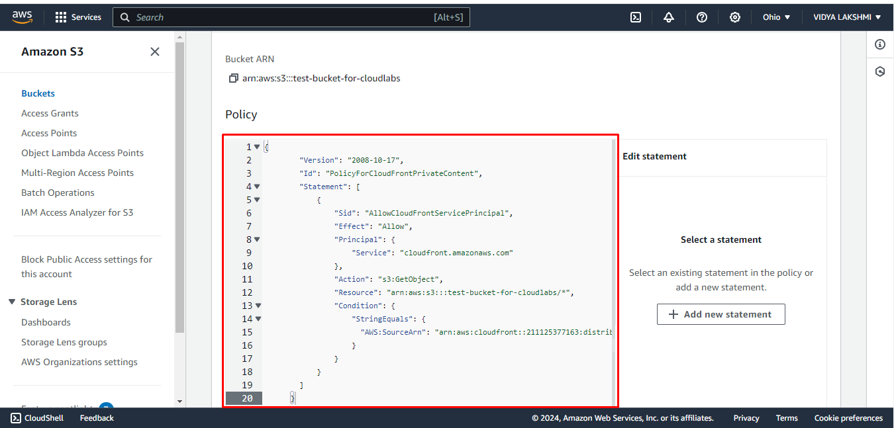

# Getting Started with AWS CloudFront

CloudFront is a content delivery network (CDN) service provided by AWS that delivers data, videos, applications, and APIs to viewers with low latency and high transfer speeds. 

**1.CloudFront:** CloudFront is like a super-fast delivery service for the content. It has many locations around the world called “edge locations.” When someone visits your website, CloudFront sends the content from the edge location closest to them, making your website load faster for them.

**2. Distribution:** A CloudFront “distribution” is like a set of instructions that tells CloudFront where your content is stored and how to deliver it to users. It specifies things like which origin server (like an S3 bucket or a web server) to get the content from and how long to cache it for.

**3. S3 Bucket:** An S3 bucket is a big digital storage container provided by AWS. You can put all kinds of stuff in it, like files, images, videos, and data. It’s like a virtual hard drive in the cloud where you can store your website’s content. When you set up a CloudFront distribution, you can tell CloudFront to get your website’s content from an S3 bucket.

**4. Regional Edge Caches:**  A larger version of an Edge location, which sits between the origin and an typical Edge location primarily to improve the performance.

# Creating an s3 bucket and CloudFront Distribution

## Introduction

This Lab guide will explain step by step procedure to you. We can use different origin for CloudFront distribution such as:

1. Amazon S3 bucket
2. Amazon S3 Object Lambda
3. Amazon S3 Access Point
4. Amazon S3 bucket that's configured as a   website endpoint
5. Add CloudFront to an existing Amazon S3 bucket

For this lab guide we are using **Amazon S3 bucket** as the origin for a CloudFront distribution.

## Exercise 1: Sign in to the AWS Management Console

1. Open your web browser and go to the [AWS Management Console](https://console.aws.amazon.com/).
2. Sign in using your AWS account credentials.
3. Click on sign in.

## Exercise 2: Navigate to the search bar and search S3

1. Once logged in, you'll land on the AWS Management Console Dashboard.
2. In the search bar at the top, Search for **S3**.
3. Click on **S3** in the dropdown as shown.

## Exercise 3: Create a Bucket

1. You'll land on the s3 console, there on top right corner you will see **region** and the dropdown button, choose the region.

You will see that the region is changed to Ohio.

Note: This region will be the origin of your file.

2. In the S3 dashboard, click on **create Bucket** .

3. You will be redirected on this page and you can check the region here.

4. Enter a unique bucket name. Bucket names must be unique across all existing bucket names in Amazon S3.

    **Note:**  If the bucket name is not unique, it will show error in the end. (Bucket name should only be in lowercase letters, numbers, dots (.), and hyphens (-))

> Example: test-bucket-for-cloudlabs

5. Leave the remaining things as default.

6. Click on the **Create Bucket**

7. You will see that your s3 bucket is created.

## Exercise 4: Insert an Object in the Bucket

>   hello-world-html.zip

  Unzip this file and save the css folder and index file in the desktop.

1. Click on the bucket name to go inside the Bucket.

2. Click on **upload**

3. Click on **Add files**

4. Select the **index.html file** that you downloaded above.

5. Scroll down and Click on **upload**.

6. The Object is now stored in the Bucket.

7. Scroll up and go to **properties** and click on it.

8. Scroll down till the end. In **Static website hosting** you will see that it is diabled, click on **Edit**

9. Click on **Enable**.

10. Scroll down and in index and error document write **"index.html"**

11. Click on **save changes**

## Exercise 5: Navigate to the search bar and search CloudFront

1. In the search bar at the top, Search for **CloudFront**.
2. Click on **CloudFront** in the dropdown as shown.

3. Select **Create a CloudFront distribution**.

4. In Origin domain select the name of the S3 bucket you stored.

5. Scroll down and Choose **Origin access control settings**
Click on **Create new OAC**

6. Scroll down and in (WAF) Click on **Do not create security protections**

7. Scroll down and in **Default root object** write **"index.html"**

8. Click on **Create Distribution**

9. In The S3 bucket policy needs to be updated banner click on **Copy policy**

10. In the same banner, choose the link to **Go to S3 bucket permissions to update policy**. (This takes you to your bucket detail page in the Amazon S3 console.)

## Exercise 6: Change permission setting in s3 bucket.

1. Now you are inside the bucket, click on **Permissions**

2. Scroll down and in Bucket policy, choose **Edit**.

3. Paste the policy that you copied.

4. Click on **Save Changes**

5. Navigate back to the CloudFront dashboard(previous tab). 

6. Click on the distribution name.

7. Wait till the status in the **Last Modified** changes to Date and time.

8. Copy the **Distribution Domain Name**

9. Paste it in new tab.

10. After copying the url, paste it in your browser you should see a default webpage saying "Hello World" as shown in the screenshot.

Congratulations!! You have successfully completed the lab!

    